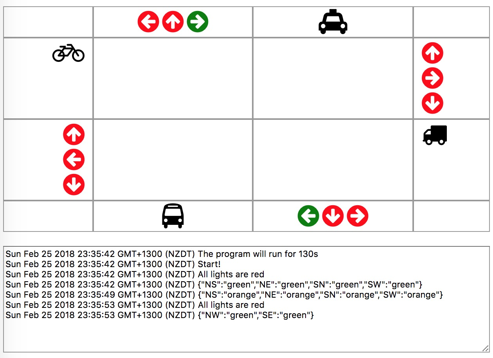

# Traffic Stop Lights Simulation
A simulation of traffic in an intersection.
The traffic lights are designated (N, S) and (E, W) like a compass.

# Assumptions
- When switching from green to red, the yellow light must be displayed for 30 seconds prior to it switching to red.
- The lights will change automatically every 5 minutes.
- Provide the output for the light changes which occur during a given thirty minute period.

# Install
`$ npm install`

# Run in command line
`$ npm start`

```
⚡ npm start

> traffic@1.0.0 start
> babel-node src/index.js

Sun Feb 25 2018 23:34:26 GMT+1300 (NZDT) The program will run for 110s
Sun Feb 25 2018 23:34:26 GMT+1300 (NZDT) Start!
Sun Feb 25 2018 23:34:26 GMT+1300 (NZDT) All lights are red
Sun Feb 25 2018 23:34:26 GMT+1300 (NZDT) {"NS":"green","NE":"green","SN":"green","SW":"green"}
Sun Feb 25 2018 23:34:33 GMT+1300 (NZDT) {"NS":"orange","NE":"orange","SN":"orange","SW":"orange"}
```

# Run website
Simply open the `index.html` on a Chrome browser or do

`$ npm run web`



# Run tests
`$ npm test`

# Build project using webpack
Run this whenever there's a change in the code or config file

`$ npm run webpack`

** Note: For the interest of time, the compiled project has faster delays. It will run for a total of 110seconds, the green lights are on for 7seconds and the yellow lights are on for 4seconds.
